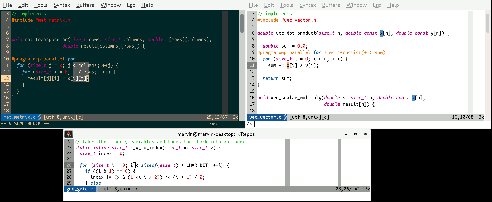

# vim-colors-bionik3
Successor of my Vim color scheme [bionik2](https://github.com/datMaffin/vim-colors-bionik2)

## Why a successor to bionik

I am pretty happy with my original bionik colorscheme. It works well.
However, I would like to work on the following shortcomings:
- When in a dark theme terminal (like a Linux tty), it does not work well.
- My colors chosen for the GUI could probably be improved ~(want to replace them with the Tango colorscheme)~
- [vim-colortemplate](https://github.com/lifepillar/vim-colortemplate) looks really interesting

## Goals of bionik2
- Dark/light should depend on the environment; ~in a GUI Vim default to light, though.~
- Be familiar to Visual Studio 2010 and Xcode light
  + Use green for the comments.
  + Use blue and magenta for keywords (and types).
- Great terminal "integration"
  + Use italic, bold and underlined also in the terminal.
  + Mainly use the (16) ANSI colors of the terminal.
  + Try to provide a good experience on a variety of selected terminal color schemes.

## Goals of bionik3
Get rid of the `CursorLine` for a few reasons:
- Being able to use the background color in the way it is intended.
  The issue with a CursorLine background color is that it takes priority.
- Having a `CursorLine` with a color will result in additional syntax drawing 
  re-calculations.

## Non-Goals
- There is no attempt in considering color blindness

## Rational
##### Making keywords (and sometimes types) bold italic:
Those words should stand out as they are special. Additionally, the readability is not hindered by the italic style, because they are always the same.
The readability argument is only partially true for types, but in my opinion one as a smaller set of used types compared to, for example, variable names.

##### Making the comments green and non-italic:
I am familiar with comments being green as it was the default in Visual Studio 2010 light, which was my introduction to programming.
Additionally, to make comments as readable as possible, they are neither dim nor in italic.
Reading comments is in my opinion very important. They should not blend into the background!
People (hopefully) write in-line comments for the **important, non-obvious** stuff.

## Recommendations
### Font
Use a font with nice looking distinct italic letters like:
- [Mononoki](https://madmalik.github.io/mononoki/) / [Monofoki](https://github.com/datMaffin/monofoki)
- Consolas (non-libre)
- [Victor Mono](https://rubjo.github.io/victor-mono/)
- [Fantasque Mono](https://github.com/belluzj/fantasque-sans)
- [IBM Plex Mono](https://www.ibm.com/plex/)
- Dank Mono (non-free)
- Operator Mono (non-free)

Or at least a font with nice italic letters like:
- [Hack](https://sourcefoundry.org/hack/)
- [Source Code Pro](https://github.com/adobe-fonts/source-code-pro)
- [Jetbrains Mono](https://www.jetbrains.com/lp/mono/)
- [Iosevka](https://typeof.net/Iosevka/)
- [Ubuntu Mono](https://design.ubuntu.com/font/)

### Terminal Colors
Make sure that "bright white" is slightly different from the background colors.

### Terminal Color Scheme

While this vim colorscheme is intended to be used with any normal terminal color scheme, if you would like to to use the colors used in the GUI as your terminal color scheme, here you go:

#### Light Terminal Colors

Use for the background white `#FFFFFF` and for the foreground black `#000000`.

| ANSI Code | Color                     |
|-----------|---------------------------|
| 0         | Black: `#252525`          |
| 1         | Red: `#e60000`            |
| 2         | Green: `#00B800`          |
| 3         | Yellow: `#e66e00`         |
| 4         | Blue: `#0a5594`           |
| 5         | Magenta: `#b30070`        |
| 6         | Cyan: `#00988e`           |
| 7         | White: `#cccccc`          |
| 8         | Bright Black: `#7f7f7f`   |
| 9         | Bright Red: `#ff3236`     |
| 10        | Bright Green: `#34ee34`   |
| 11        | Bright Yellow: `#ffa552`  |
| 12        | Bright Blue: `#428ecf`    |
| 13        | Bright Magenta: `#ec4fb1` |
| 14        | Bright Cyan: `#4bcbcf`    |
| 15        | Bright White: `#ededed`   |

#### Dark Terminal Colors

Use for the background black with a green hint `#062626` and for the foreground tan `#d2b48c`.

| ANSI Code | Color                     |
|-----------|---------------------------|
| 0         | Black: `#2E3436`          |
| 1         | Red: `#CC0000`            |
| 2         | Green: `#32CD32`          |
| 3         | Yellow: `#E66E00`         |
| 4         | Blue: `#2277be`           |
| 5         | Magenta: `#b30070`        |
| 6         | Cyan: `#0db1a7`           |
| 7         | White: `#ffd7a2`          |
| 8         | Bright Black: `#555753`   |
| 9         | Bright Red: `#ff3236`     |
| 10        | Bright Green: `#34EE34`   |
| 11        | Bright Yellow: `#FFA552`  |
| 12        | Bright Blue: `#2277BE`    |
| 13        | Bright Magenta: `#EC4FB1` |
| 14        | Bright Cyan: `#4BCBCF`    |
| 15        | Bright White: `#ffffff`   |
